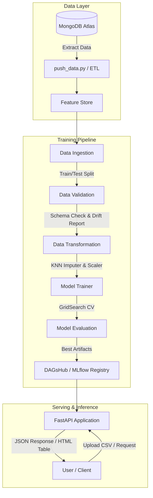

<div align="center">

# 🛡️ Network Security — Phishing Detection System
### *Production-Ready End-to-End MLOps Pipeline for Phishing Classification*

[](https://www.python.org/)
[](https://fastapi.tiangolo.com/)
[](https://www.mongodb.com/)
[](https://scikit-learn.org/)
[](https://dagshub.com/imehranasgari/NetworkSecurity.mlflow)
[](https://www.docker.com/)
[](https://opensource.org/licenses/Apache-2.0)

<p align="center">
  <a href="#key-features">Key Features</a> •
  <a href="#dataset">Dataset</a> •
  <a href="#system-architecture">System Architecture</a> •
  <a href="#model-evaluation--benchmarks">Model Evaluation</a> •
  <a href="#project-structure">Project Structure</a> •
  <a href="#quick-start">Quick Start</a> •
  <a href="#api-endpoints">API Endpoints</a> •
  <a href="#author">Author</a>
</p>

---

</div>

## 📌 Overview

The **Network Security Phishing Detection** system is an end-to-end Machine Learning solution designed to classify malicious and phishing URLs based on structural webpage characteristics. This defensive security platform automates data ingestion, schema validation, data drift detection, distributed model training, experiment tracking, and low-latency RESTful inference.

Built with modular software engineering principles, the system decouples configuration, logging, custom exceptions, and artifact persistence into robust production pipelines.

---

## 📂 Dataset

This project utilizes a standard, publicly available academic benchmark dataset for phishing website detection (sourced from public repositories such as the UCI Machine Learning Repository). It contains 30 anonymized URL and webpage structure features used exclusively for defensive classification research and educational purposes.

---

## ✨ Key Features

- **Automated Data Ingestion:** Extracts feature sets from MongoDB and synchronizes with local/cloud feature stores.
- **Data Validation & Drift Detection:** Validates column counts, data types, and uses statistical distance checks (Kolmogorov-Smirnov test) against schema definitions (`schema.yaml`) to capture data drift.
- **Robust Transformation Engine:** Applies `KNNImputer` for missing values and robust scaling, serializing the fitted preprocessor pipeline for reproducible inference.
- **Model Training & Hyperparameter Tuning:** Automated training and benchmarking across multiple classifiers (Random Forest, Gradient Boosting, XGBoost, CatBoost, AdaBoost, Logistic Regression) with GridSearchCV.
- **Centralized Experiment Tracking:** Full parameter, artifact, and metric logging via MLflow integrated with DAGsHub.
- **RESTful API Serving:** High-performance FastAPI server supporting real-time single-sample inference and batch prediction via CSV uploads.
- **Dockerized & Cloud-Ready:** Containerized environment for seamless deployment to AWS (ECR/EC2/S3).

---

## 📊 Model Evaluation & Benchmarks

During the training pipeline, candidate classifiers were systematically tuned and benchmarked. Metrics, model weights, and preprocessors are tracked live on **MLflow / DAGsHub**.

🔗 **Live MLflow Experiment:** [View DAGsHub Experiment Runs](https://dagshub.com/imehranasgari/NetworkSecurity.mlflow/#/experiments/0)

### 🏆 Selected Production Model: Random Forest (v3)

- **Selected Estimator:** `RandomForestClassifier(n_estimators=32)`
- **Registry Status:** Registered and versioned (`Version 3`) in MLflow Model Registry.
- **Target Metric:** Optimized for high balanced F1-Score to minimize False Positives (preventing legitimate traffic from being misflagged).

| Metric | Score | Note |
| :--- | :---: | :--- |
| **Accuracy** | **~98%** | Evaluated on unseen test split |
| **F1-Score** | **~98%** | Harmonic mean of Precision and Recall |
| **Model Version** | `v3` | Logged and packaged with fitted preprocessor |

> *Note: Exact real-time metrics and run artifacts are tracked under run ID [`exultant-bee-917`](https://dagshub.com/imehranasgari/NetworkSecurity.mlflow/#/experiments/0/runs/8c45f5a81289435bb725f04d8f80024f).*

---

## 🏗️ System Architecture



---

## 🗂️ Project Structure

```text
NetworkSecurity/
├── networksecurity/
│   ├── cloud/                    # Cloud storage & S3 sync utilities
│   ├── components/               # Core pipeline stages
│   │   ├── data_ingestion.py     # MongoDB export & train/test splitting
│   │   ├── data_validation.py    # Schema verification & data drift checks
│   │   ├── data_transformation.py# Imputation, transformation & scaling
│   │   └── model_trainer.py      # Multi-model evaluation & tuning
│   ├── configuration/            # Database & cloud connection configurations
│   ├── constants/                # Global pipeline constants & filepaths
│   ├── entity/                   # Data classes (ConfigEntity, ArtifactEntity)
│   ├── exception/                # Custom exception wrapper with traceback
│   ├── logging/                  # Timestamped logging configuration
│   ├── pipeline/                 # Training & batch prediction pipelines
│   └── utils/                    # Common helper functions (YAML, pickle IO)
├── data_schema/
│   └── schema.yaml               # Feature definitions, types & target column
├── templates/                    # Jinja2 HTML templates for Web UI
├── app.py                        # FastAPI entry point for inference & training
├── main.py                       # Standalone pipeline runner
├── push_data.py                  # ETL script to populate MongoDB
├── Dockerfile                    # Container configuration
├── requirements.txt              # Project dependencies
├── setup.py                      # Packaging script for local modules
└── README.md                     # Documentation
```

---

## 🚀 Quick Start

### 1. Prerequisites
- **Python 3.10+**
- **MongoDB Atlas account** (or local MongoDB instance)
- **Git**

### 2. Installation

Clone the repository:
```bash
git clone https://github.com/imehranasgari/NetworkSecurity.git
cd NetworkSecurity
```

Create and activate a virtual environment:
```bash
# Linux / macOS
python3 -m venv venv
source venv/bin/activate

# Windows
python -m venv venv
.\venv\Scripts\activate
```

Install dependencies:
```bash
pip install --upgrade pip
pip install -r requirements.txt
```

### 3. Environment Variables
Create a `.env` file in the project root:
```env
MONGODB_URL_KEY="your_mongodb_connection_string"
AWS_ACCESS_KEY_ID="your_aws_access_key"           # Optional
AWS_SECRET_ACCESS_KEY="your_aws_secret_key"       # Optional
DAGSHUB_TOKEN="your_dagshub_token"               # Optional for MLflow
```

---

## 💻 Execution Guide

### Step 1: Push Raw Data to MongoDB
Initialize the database collection with the dataset:
```bash
python push_data.py
```

### Step 2: Trigger Training Pipeline
Run end-to-end data ingestion, validation, preprocessing, and model training:
```bash
python main.py
```
> Artifacts (`preprocessor.pkl`, `model.pkl`) and data drift reports will be generated in `Artifacts/`, with run tracking logged to DAGsHub.

### Step 3: Run the FastAPI Web Application
Start the Uvicorn ASGI server:
```bash
uvicorn app:app --host 0.0.0.0 --port 8000 --reload
```

Interactive API documentation:
- **Swagger UI:** [http://localhost:8000/docs](http://localhost:8000/docs)
- **Redoc UI:** [http://localhost:8000/redoc](http://localhost:8000/redoc)

---

## 🌐 API Endpoints

| Method | Endpoint | Description |
| :--- | :--- | :--- |
| `GET` | `/` | Renders web UI landing page |
| `GET` | `/train` | Triggers asynchronous full pipeline retraining |
| `POST` | `/predict` | Accepts CSV batch file upload and renders predictions |

---

## 🐳 Docker Deployment

Build the container image:
```bash
docker build -t networksecurity:latest .
```

Run the container:
```bash
docker run -p 8000:8000 --env-file .env networksecurity:latest
```
## 📚 Acknowledgements & References
- Project architecture inspired by the *Complete MLOps Bootcamp* curriculum, extended with custom MLflow experiment tracking, DAGsHub integrations, and modular pipeline design.
---

## 👤 Author

**Mehran Asgari**
- **GitHub:** [@imehranasgari](https://github.com/imehranasgari)
- **DAGsHub:** [imehranasgari](https://dagshub.com/imehranasgari)

---

## 📄 License

This project is licensed under the [Apache 2.0 License](LICENSE).